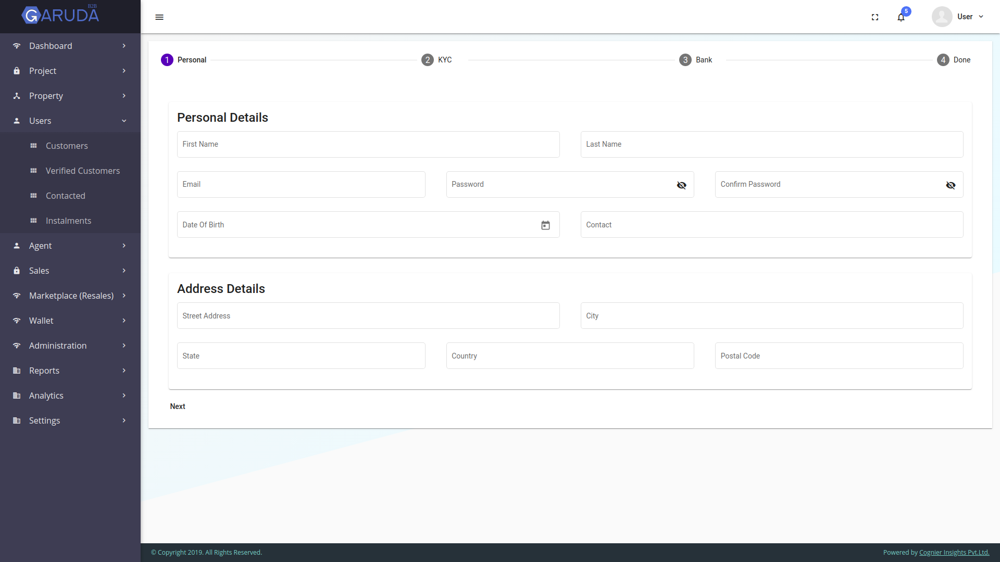

# Garuda-for-Builders
Garuda-for-Builders is open-source product which are using Angular 2+ for FrontEnd part

## Getting Started

Follow the below instructions to Start with Garuda-for-Builders

### Prerequisites
This is the tech Stack we are using to develop Garuda-for-Builder. Make sure you are familiar with all of these:-
1. Angular 6/7/8 - Front End Portion


### Installing
#### Setting up the Angular repositories:
* For Garuda Application clone the Garuda-for-Builder master branch
* Install Angular and do ``` npm install ```
* Change the url for server in url.ts from xxx.xx.xx.xxx to localhost to give the api calls to your local server.
* To run the project execute:
    ``` 
    ng serve --port 5000
    
    ````
   #### Garuda-API
   * Make sure you have to run  Garuda-API ,for more detail to run Garuda-API click [here](https://github.com/InfoScienceLabs/Garuda-API)


## Screenshots:-  
 ##### Screenshots for Admin panel 
  * Dashboard->Charts Boards  
    
  * project-> Create ->Add 
  
  * Property -> Create
  
  * Users -> Customers -> Add
  
  * Agent -> Create ->Add
    
  * Reports -> Create
    
  * Settings -> Coupons
  
 
  ##### Screenshots for Government panel 
   * Marketplace
   
   * Property
   
   * Tax
   
  
   ##### Screenshots for User panel 
   * Marketplace
  

## Authors

* **INFO SCIENCE LABS** - *Initial work* - [Info Science Lab](https://github.com/InfoScienceLabs)

See also the list of [contributors](https://github.com/Infosciencelabsdev/Garuda/graphs/contributors) who participated in this project.

## Contact Us
  Email:- info@infoscience.co
## License
This project is licensed under the Apache License- see the [LICENSE](https://github.com/InfoScienceLabs/Garuda-for-Builders/blob/master/LICENSE) file for details


